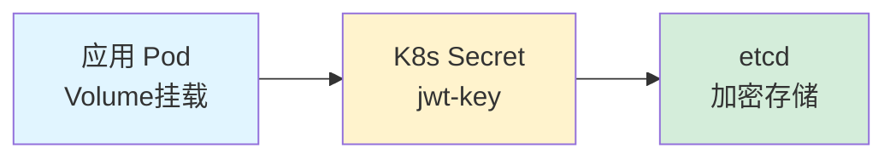
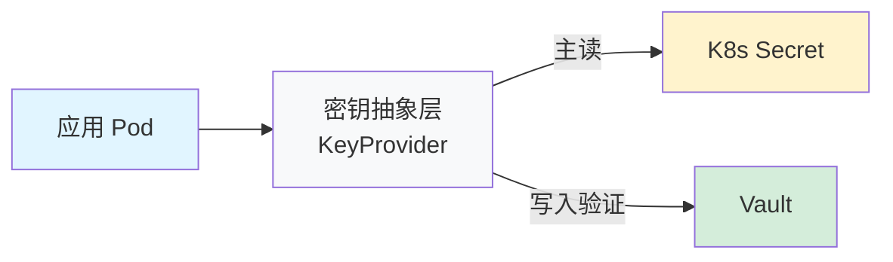
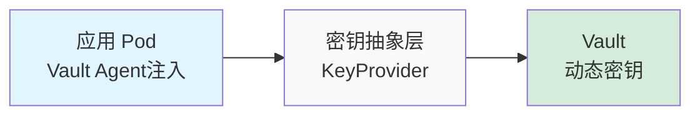

# K8s Secrets → Vault 迁移指南

本文档描述如何从 Kubernetes Secrets 平滑迁移到 HashiCorp Vault，无需修改业务代码。

---

## 架构概览

### 阶段对比

| 阶段 | 名称 | 密钥来源 | 特点 |
|:-----|:-----|:---------|:-----|
| 1 | K8s Secrets | Volume 挂载 | 当前使用，etcd 加密存储 |
| 2 | 双写期 | K8s + Vault | 迁移准备，Vault 写入验证 |
| 3 | Vault 生产 | Vault Agent | 动态密钥，自动轮换 |

### 阶段 1: K8s Secrets（当前）



### 阶段 2: 双写期（迁移准备）



### 阶段 3: Vault 生产



---

## 环境变量配置

### 阶段 1: K8s Secrets (当前)

```yaml
# deployment.yaml
apiVersion: apps/v1
kind: Deployment
spec:
  template:
    spec:
      containers:
      - name: zrun-bff
        env:
        - name: KEY_PROVIDER
          value: "file"          # 或 "auto"
        - name: SECRETS_PATH
          value: "/etc/secrets"
        volumeMounts:
        - name: jwt-key
          mountPath: /etc/secrets
          readOnly: true
      volumes:
      - name: jwt-key
        secret:
          secretName: jwt-private-key
```

### 阶段 2: 准备 Vault

```bash
# 1. 在 Vault 中启用 KV secrets engine v2
vault secrets enable -path=secret kv-v2

# 2. 创建密钥路径
vault kv put secret/zrun/jwt_private_key \
  value="$(cat jwt-private-key.pem)"

vault kv put secret/zrun/casdoor_client_secret \
  value="your-casdoor-secret"

# 3. 配置 Kubernetes 认证
vault auth enable kubernetes

vault write auth/kubernetes/config \
  kubernetes_host="https://$KUBERNETES_PORT_443_TCP_ADDR:443" \
  token_reviewer_jwt="$(cat /var/run/secrets/kubernetes.io/serviceaccount/token)"

vault write auth/kubernetes/role/bff-service \
  bound_service_account_names=bff-service \
  bound_service_account_namespaces=default \
  policies=zrun-bff-policy \
  ttl=24h

# 4. 创建策略
vault policy write zrun-bff-policy - <<EOF
# 读取 JWT 私钥
path "secret/data/zrun/jwt_private_key" {
  capabilities = ["read"]
}
# 读取 Casdoor 密钥
path "secret/data/zrun/casdoor_client_secret" {
  capabilities = ["read"]
}
# 健康检查
path "secret/data/zrun/health" {
  capabilities = ["read"]
}
EOF
```

### 阶段 3: 切换到 Vault

```yaml
# deployment.yaml
apiVersion: apps/v1
kind: Deployment
spec:
  template:
    spec:
      containers:
      - name: zrun-bff
        env:
        - name: KEY_PROVIDER
          value: "vault"         # 切换到 Vault
        - name: VAULT_ADDR
          value: "https://vault.example.com:8200"
        - name: VAULT_ROLE
          value: "bff-service"
        - name: VAULT_NAMESPACE
          value: "tenant-1"       # Vault Enterprise 可选
        # 移除 volumeMounts
```

---

## 迁移步骤

### Phase 1: 验证 K8s Secrets (Week 1)

```bash
# 1. 确认当前使用 K8s Secrets
kubectl get deployment zrun-bff -o yaml | grep KEY_PROVIDER
# 预期: KEY_PROVIDER: file (或未设置)

# 2. 验证密钥文件挂载
kubectl exec -it deployment/zrun-bff -- ls -la /etc/secrets/
# 预期: jwt_private_key.pem

# 3. 测试应用启动
kubectl logs deployment/zrun-bff | grep "key_provider_selected"
# 预期: key_provider_selected=...
```

### Phase 2: 部署 Vault (Week 2)

```bash
# 1. 使用 Helm 部署 Vault
helm repo add hashicorp https://helm.releases.hashicorp.com
helm install vault hashicorp/vault \
  --set "server.dev.enabled=true" \
  --set "ui.enabled=true" \
  --set "server.dev.devRootToken='dev-only-token'"

# 2. 验证 Vault 可访问
kubectl port-forward svc/vault 8200:8200
vault status

# 3. 导入现有密钥到 Vault
vault kv put secret/zrun/jwt_private_key \
  value="$(kubectl get secret jwt-private-key -o jsonpath='{.data.key\.pem}' | base64 -d)"

vault kv put secret/zrun/casdoor_client_secret \
  value="$(kubectl get secret casdoor -o jsonpath='{.data.CLIENT_SECRET}' | base64 -d)"
```

### Phase 3: 双写验证期 (Week 3-4)

```yaml
# deployment.yaml - 添加 Vault 配置但保持 K8s 作为主
apiVersion: apps/v1
kind: Deployment
spec:
  template:
    spec:
      containers:
      - name: zrun-bff
        env:
        - name: KEY_PROVIDER
          value: "auto"           # auto 模式：fallback 到 K8s
        - name: VAULT_ADDR
          value: "http://vault:8200"
        - name: VAULT_ROLE
          value: "bff-service"
        # 保留 K8s Secrets 作为 fallback
        volumeMounts:
        - name: jwt-key
          mountPath: /etc/secrets
          readOnly: true
```

**验证步骤：**
```bash
# 1. 检查日志，确认从 Vault 读取
kubectl logs deployment/zrun-bff | grep "key_from_vault"

# 2. 测试 Vault 连接
kubectl exec -it deployment/zrun-bff -- \
  curl -s http://vault:8200/v1/sys/health

# 3. 模拟 Vault 故障，验证 fallback
kubectl delete pod -l app=vault
# 应用应继续工作 (fallback 到 K8s)
```

### Phase 4: 完全迁移 (Week 5+)

```yaml
# deployment.yaml - 移除 K8s Secrets
apiVersion: apps/v1
kind: Deployment
spec:
  template:
    spec:
      containers:
      - name: zrun-bff
        env:
        - name: KEY_PROVIDER
          value: "vault"         # 强制使用 Vault
        - name: VAULT_ADDR
          value: "https://vault.example.com:8200"
        - name: VAULT_ROLE
          value: "bff-service"
        # 移除 volumeMounts
      # 移除 volumes
```

```bash
# 清理 K8s Secrets
kubectl delete secret jwt-private-key casdoor-client-secret
```

---

## 回滚计划

每个阶段都可以安全回滚：

```yaml
# 从 Vault 回滚到 K8s
env:
- name: KEY_PROVIDER
  value: "file"              # 切换回文件模式
- name: SECRETS_PATH
  value: "/etc/secrets"
volumeMounts:
- name: jwt-key
  mountPath: /etc/secrets
  readOnly: true
```

---

## 监控指标

```python
# 添加到应用日志
logger.info(
    "key_provider_used",
    provider=provider.provider_name,
    key_name=key_name,
    cache_hit=False,
)

# Prometheus 指标
from prometheus_client import Counter, Histogram

key_fetch_counter = Counter(
    'key_fetch_total',
    'Total key fetch operations',
    ['provider', 'key_name', 'status']
)

key_fetch_latency = Histogram(
    'key_fetch_latency_seconds',
    'Key fetch latency',
    ['provider']
)
```

---

## 故障排查

### 问题：Vault 认证失败

```bash
# 检查 Service Account token
kubectl exec -it deployment/zrun-bff -- \
  cat /var/run/secrets/kubernetes.io/serviceaccount/token

# 检查 Vault role 配置
vault read auth/kubernetes/role/bff-service

# 测试认证
vault write auth/kubernetes/login \
  role=bff-service \
  jwt=$(cat /var/run/secrets/kubernetes.io/serviceaccount/token)
```

### 问题：密钥读取超时

```yaml
# 添加超时配置
env:
- name: VAULT_ADDR
  value: "https://vault:8200"
- name: VAULT_MAX_RETRIES
  value: "3"
- name: VAULT_TIMEOUT
  value: "5s"
```

---

## 安全检查清单

- [ ] Vault 启用 TLS (生产环境)
- [ ] Vault 启用审计日志
- [ ] 配置自动密钥轮换 (TTL)
- [ ] 限制 Vault token TTL
- [ ] 使用 RBAC 限制访问
- [ ] 定期备份 Vault 数据
- [ ] 监控 Vault 性能指标
- [ ] 配置告警 (Vault 健康状态)
